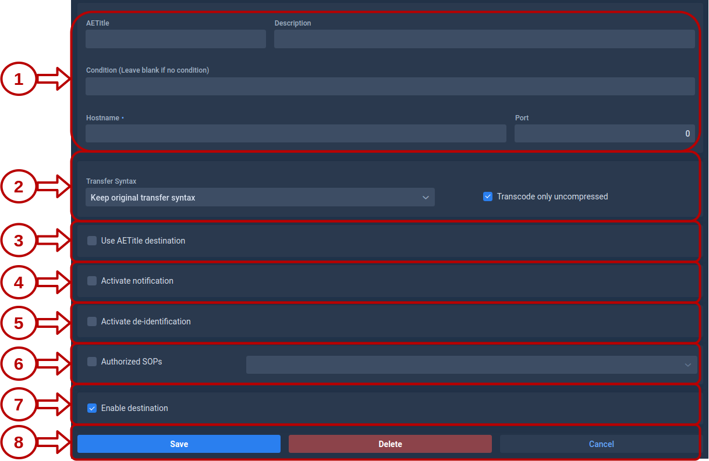
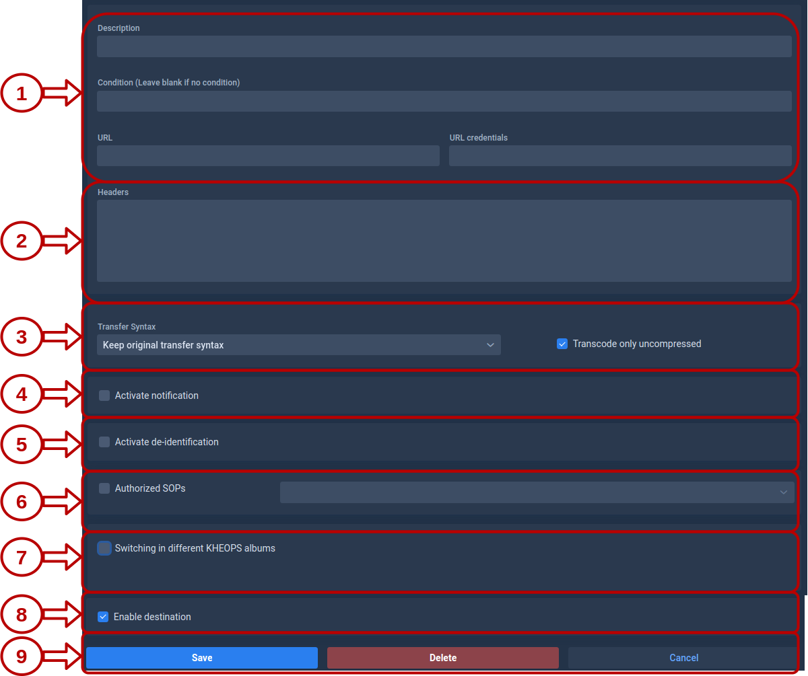

# Gateway
{: .no_toc }

## Table of contents
{: .no_toc .text-delta }

1. TOC
{:toc}

## Forward Node

This page allows the creation of a forward node and its edition. All the forward nodes present in your KARNAK are listed here. The forward node will configure the Application Entity of your DICOM node.


**1. Creation of a forward node**

Once clicked on the button "New forward node", a form will appear, as below, instead of the "New forward node" button (It will replace it).


To create a new forward node, you have to complete the "Forward AETitle" input and click on the "Add" button. Once added, it will appear in the list of forward nodes and will be selected. A Forward AETitle must be unique.

**2. Forward node list**

This list displays all the forward nodes created in your KARNAK instance. You can select a forward node to view and manage its details on the right panel.

**3. Forward node inputs**

You can directly modify the value of the forward AETitle and its description. To save your changes, you have to click on the "Save" action button.

**4. Forward node sources or destinations**

In an Application Entity, you can add source control, which checks if the received DICOM is provided from a known source. You can also create one or more destinations to distribute received DICOM instance. These destinations can communicate with the DICOM or DICOM WEB protocol.


**4.1 Sources or destinations navigation**

Depending on the navigation selected, between sources and destinations, the list and the action buttons will change.

**4.2 Filter in destinations or sources list**

The destination filter will use the destination description.

The source filter will use the AE title, hostname and description source.

**4.3 Destination or sources list**

All the destinations or sources, depending on the navigation selected, associated to the forward node is listed here.

You can click on a destination or source present in this list to view details or to modify it.

**4.4 Action buttons**

The action buttons will change depending the navigation selected.

For a destination, these buttons defined the protocol you can use to create a destination. The protocol can be DICOM or DICOM WEB. The details for the destination creation will be explained below in the section [Destinations](#destinations).

If you click on the DICOM button, the DICOM destination creation page will appear.

If you click on the STOW button, the DICOM WEB destination creation page will appear.

For a source, the illustration below show the button. The details for the source creation will be explained below in the section [Sources](#sources).


 If you click on the the Sources button, the source creation page will appear.

**5. Action buttons**

You have three action buttons available.

* "Save" will save your change apply on the forward node inputs.
* "Delete" will delete your forward node
* "Cancel" will cancel the changes applied on the forward node inputs.

## Destinations

**Beware**, to activate the de-identification in a destination, you must first [create a new project](projects#1-create-a-project).

You can create a destination that sends your studies using the [DICOM](#dicom-destination) or [STOW](#stow-destination) protocol.

### DICOM destination

For a DICOM destination the following is mandatory:

* AETitle
* Hostname
* Port ( Should be between 1 and 65535)



**1. Destination field**

These fields define the destination to which KARNAK should send.

The hostname and the port will be used to define the host in case the "Use AETitle destination" is not checked.

If "Use AETitle destination" is checked, the AETitle defined will be used as host.

**2. Notifications**

These fields will allow you to define the emails to be notified during various events that take place during the sending.

* Error subject prefix: Prefix of the email object when containing an issue. Default value: ERROR.
* Subject pattern: Pattern of the email object, see this [link](https://dzone.com/articles/java-string-format-examples). Default value: [Karnak Notification] %s %.30s.
* Subject values: Values injected in the pattern [PatientID StudyDescription StudyDate StudyInstanceUID]. Default value: PatientID,StudyDescription
* Interval: Interval in seconds for sending a notification (when no new image is arrived in the archive folder). Default value: 45

**3. De-identification**

The de-identification in the DICOM destination will be explained below, in the section [Activate the de-identification](#activate-the-de-identification)

**4. Authorized SOPs**

This field allows you to define a filter on a list of SOPs. The chosen SOPs will serve as a filter for KARNAK when sending. This allow you to define a destination which is applied only for SOPs of your choice. The [SOPs present](http://dicom.nema.org/medical/Dicom/current/output/chtml/part04/sect_B.5.html) in the list are defined by DICOM.

If "Authorized SOPs" **is checked**, you can define one or more SOPs.

If "Authorized SOPs" **is not checked**, KARNAK will not apply a SOP filter and will let all SOPs pass.

The following illustration shows the list of SOPs with two SOPs selected.


**5. Actions buttons**

You have three action buttons available.

* "Save" will create a new DICOM destination or update your modifications on the selected DICOM destination.
* "Delete" will delete the selected DICOM destination.
* "Cancel" will cancel the changes applied on the selected source. You will be redirect to the forward node.

### STOW destination

For a STOW destination the following is mandatory:

* URL



**1. Destination field**

The URL is the DICOM endpoint of your final destination.

The URL credentials is the STOW-RS service (format is \"user:password\")

**2. Destination headers**

This field will contains the headers for HTTP request.

To add the header *Authorization: Bearer 123456790* you must write following the format below:

```
<key>Authorization</key>
<value>Bearer 1234567890</value>
```

**3. Notifications**

These fields will allow you to define the emails to be notified during various events that take place during the sending.

* Error subject prefix: Prefix of the email object when containing an issue. Default value: ERROR.
* Subject pattern: Pattern of the email object, see this [link](https://dzone.com/articles/java-string-format-examples). Default value: [Karnak Notification] %s %.30s.
* Subject values: Values injected in the pattern [PatientID StudyDescription StudyDate StudyInstanceUID]. Default value: PatientID,StudyDescription
* Interval: Interval in seconds for sending a notification (when no new image is arrived in the archive folder). Default value: 45

**4. De-identification**

The de-identification in the STOW destination will be explained below, in the section [Activate the de-identification](#activate-the-de-identification)

**5. Authorized SOPs**

This field allows you to define a filter on a list of SOPs. The chosen SOPs will serve as a filter for KARNAK when sending. This allow you to define a destination which is applied only for SOPs of your choice. The [SOPs present](http://dicom.nema.org/medical/Dicom/current/output/chtml/part04/sect_B.5.html) in the list are defined by DICOM.

If "Authorized SOPs" **is checked**, you can define one or more SOPs.

If "Authorized SOPs" **is not checked**, KARNAK will not apply a SOP filter and will let all SOPs pass.

The following illustration shows the list of SOPs with two SOPs selected.


**6. Switching in different KHEOPS albums**

You have the possibility of sharing your data in different KHEOPS album. For this you must use a DICOM endpoint from KHEOPS.

The purpose of this functionality is to allow sending your data to a single destination and to use the KHEOPS API to propagate your data to different places without having to create a new destination.

The following illustration show a scenario of this functionality. The illustrated scenario allows you to send a DICOM data to KARNAK. KARNAK has a destination defined to send the data to a KHEOPS album (Album main). This means that this album will regroup all the data sent by KANRAK. To prevent researchers or end users from having access to all the data, the data will be shared in other albums according to defined conditions.

1. The DICOM data is send to KARNAK
2. KARNAK send the data to the album main in KHEOPS
3. The data will be shared in the album X and in the album Y


Details for configuring this feature are explained in the [KHEOPS](kheops#create-a-switching-kheops-album) chapter.

**7. Actions buttons**

You have three action buttons available.

* "Save" will create a new STOW destination or update your modifications on the selected STOW destination.
* "Delete" will delete the selected STOW destination.
* "Cancel" will cancel the changes applied on the selected source. You will be redirect to the forward node.

### Activate the de-identification

To use de-identification, a project must be present. See [create a new project](projects#1-create-a-project) if you haven't already created a project.

When you created a new destination, "Activate the de-identification" is not checked. When you check the box, KARNAK will react in two different ways depending on whether you have a project or not.

If you have not yet created a project a pop up will appear asking you to create a project, as illustrated below. 


* **Create a project** will redirect you to the page project. **Beware**, if you click on this button your configuration already made will be lost, save it first.

* **Continue** will close the pop-up and the de-identification will be unchecked.

If you have already create the project, you can configure the de-identifcation.


**1. Project**

Here you can select the project to use for de-identification.

A message below shows you which profile is associated with the selected project.

**2. Pseudonym Type**

You can chose three different type of pseudonym, illustrated below.


**Pseudonym are generate automatically** will generate the pseudonym and store it by using Mainzelliste.

**Pseudonym is already store in KARNAK** will use the pseudonym that an user has added by using the [pseudonym page](extpseudo). Pseudonym added alive in the KARNAK cache. **Beware** if the patient to be de-identified is not present in the KARNAK cache, it will not be sent.

**Pseudonym is in a DICOM tag**, will look for the pseudonym in a DICOM tag. The illustration below shows the different elements to configure.


**1 Use as Patient Name**

Instead to use the [generated patient name by KARNAK](../deidentification/rules#patientid-generation), it will contains the pseudonym find in the DICOM tag.

**2 Fields to find the pseudonym**

This fields are used to define the configuration to find the pseudonym.

Tag - will contain the tag where KARNAK should look for the pseudonym.

Delimiter - will contain the delimiter to use for split the value of the tag. (Optionnal)

Position - will contain the position where the pseudonym is after the split. (Optionnal)

In case the delimiter and the position fields are not defined, KARNAK will directly use the value present in the given tag.

**3 Save the pseudonym**

If "Save pseudonym" is checked, KARNAK will save the patient and his pseudonym in Mainzelliste.

## Sources

A source is used to perform control over the sending entity to the associated forward node. It will check if the received DICOM is provided from an AET known.

In the case that no source is defined, the verification does not take place and the forward node can receive data from any AET.


**1. Form input**

All the fields are optional, excepted the AETitle, which is mandatory.

If the "Check the hostname" box is checked, KARNAK also checks the hostname.

**2. Action buttons**

You have three action buttons available.

* "Save" will create a new source or update your modifications on the selected source.
* "Delete" will delete the selected source.
* "Cancel" will cancel the changes applied on the selected source. You will be redirect to the forward node.